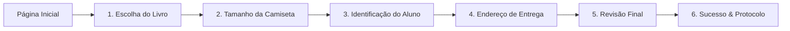

# 🎓 Kit de Boas-Vindas — Pós-Graduação em Educação Física | Faculdade Phorte

Aplicação web desenvolvida em **Next.js 14 com TypeScript** para a personalização e solicitação do Kit de Boas-Vindas exclusivo para alunos matriculados nos cursos de Pós-Graduação da Faculdade Phorte.

---

## 📌 1. Visão Geral da Aplicação

O projeto é estruturado em **2 páginas independentes**:

1. **Página Inicial (`/` - `index.html`)**:
   - *Design Institucional Dark*: Visual moderno com paleta escura (`#020202`, `#070707`), iluminação radial Phorte e tipografia **Poppins**.
   - Apresenta o benefício do kit com imagem dos itens oficiais e botão CTA de entrada rápida (*"Começar agora"*).
2. **Página do Wizard (`/personalizar/` - `personalizar/index.html`)**:
   - Fluxo interativo guiado em 5 etapas para escolha do livro, tamanho da camiseta, validação de matrícula, endereço de entrega e revisão final.

---

## 🚀 2. Fluxo Passo a Passo (Etapas do Wizard)



### 📚 Etapa 1: Escolha do Livro Físico
- Catálogo com **17 livros de referência** da Editora Phorte divididos em 4 categorias:
  - *Treinamento & Força*
  - *Esportes & Performance*
  - *Saúde & Reabilitação*
  - *Educação Física & Dança*
- Busca em tempo real por título, autor ou categoria.
- Barra flutuante (*Dock*) de confirmação do livro selecionado.

### 👕 Etapa 2: Tamanho da Camiseta Oficial
- Opções de tamanho: **PP, P, M, G, GG e XG**.
- **Diagrama Gráfico Interativo**: Ilustração vetorial da camiseta que atualiza dinamicamente as cotas de **Largura (tórax)** e **Comprimento (altura)** em centímetros para cada tamanho escolhido.

### 👤 Etapa 3: Identificação Acadêmica do Aluno
- **Campos Obrigatórios**: Nome Completo, CPF, WhatsApp, E-mail e Curso de Pós-Graduação.
- **Validações Reais**:
  - Validação algorítmica matemática do CPF (11 dígitos com cálculo dos 2 dígitos verificadores).
  - Máscaras automáticas de CPF e Telefone/WhatsApp.
  - E-mail obrigatório com validação de formato para recebimento do protocolo e atualizações de entrega.
  - Checkbox de declaração de matrícula ativa.

### 📍 Etapa 4: Endereço de Entrega (Frete Grátis)
- **Integração ViaCEP (`https://viacep.com.br/ws/${cep}/json/`)**: Preenchimento automático de logradouro, bairro, cidade e estado assim que o aluno digita os 8 dígitos do CEP.
- Campos para Número e Complemento (Apto, Bloco, etc.).

### 📋 Etapa 5: Revisão Final
- Visualização linear (cards verticais completos empilhados):
  - **01. Livro Escolhido** (capa local + autor + categoria)
  - **02. Camiseta Oficial** (tamanho + dimensões em cm)
  - **03. Dados Acadêmicos** (nome, CPF, WhatsApp, e-mail, curso)
  - **04. Endereço de Entrega** (logradouro, número, bairro, cidade, UF, CEP)
- Botões individuais de **"Alterar"** em cada bloco para edição instantânea.

### ✅ Etapa 6: Confirmação & Protocolo
- Geração de código exclusivo no padrão `PK-2608-XXXXXX`.
- Botão de 1 clique para **"Copiar Protocolo"**.
- Informações sobre prazos de validação cadastral e envio.

---

## 🔗 3. Como os Dados São Gravados (Integrações)

Ao clicar em *"Confirmar e Solicitar Envio"*, o sistema dispara 3 ações coordenadas:

1. **Google Sheets (Planilha de Controle de Envios)**:
   - Os dados são enviados via POST para o Webhook do Google Apps Script (`src/services/sheets.ts`).
   - A planilha grava uma nova linha com:
     - *Coluna A*: Protocolo Gerado (`PK-2608-XXXXXX`)
     - *Coluna B*: Data e Hora da Solicitação
     - *Coluna C*: Nome Completo do Aluno
     - *Coluna D*: CPF (formatado)
     - *Coluna E*: WhatsApp
     - *Coluna F*: E-mail de Notificações
     - *Coluna G*: Curso de Pós-Graduação
     - *Coluna H*: Título do Livro Selecionado
     - *Coluna I*: Categoria do Livro
     - *Coluna J*: Tamanho da Camiseta
     - *Coluna K*: Medidas (Largura × Altura em cm)
     - *Coluna L a R*: Endereço Completo (CEP, Rua, Número, Complemento, Bairro, Cidade, UF)
     - *Coluna S*: Status do Pedido (`Pendente / Em Separação`)

2. **RD Station Marketing**:
   - Evento de conversão enviado via API (`src/services/rdstation.ts`):
     - `identificador`: `kit-boas-vindas-pos-ed-fisica`
     - `cf_protocolo_kit`: Código do protocolo
     - `cf_curso_pos`: Curso do aluno
     - `cf_livro_escolhido`: Título do livro
     - `cf_tamanho_camiseta`: Tamanho da camiseta
     - Tags: `kit-boas-vindas`, `pos-graduacao`, `ed-fisica`

3. **Backup Local (`localStorage`)**:
   - Cópia de segurança gravada sob `phorte_kit_backup_[PROTOCOLO]` no navegador do aluno.

---

## 📁 4. Estrutura de Diretórios

```
Pos/kit boas vindas cursos educacao fisica/
├── public/
│   └── images/                     # 20 imagens locais (.webp) de livros, logos e mockups
├── src/
│   ├── app/
│   │   ├── globals.css             # Design System Phorte + Poppins + Temas
│   │   ├── layout.tsx              # Root layout com Meta SEO e Viewport
│   │   ├── page.tsx                # Página 1: Landing Page (Dark)
│   │   └── personalizar/
│   │       └── page.tsx            # Página 2: Wizard de 5 Etapas
│   ├── components/
│   │   ├── header/Header.tsx       # Topbar institucional
│   │   ├── progress/ProgressBar.tsx # Barra de etapas 1 a 5
│   │   └── steps/
│   │       ├── Step0Home.tsx       # Conteúdo da Landing Page
│   │       ├── Step1Books.tsx      # Catálogo e busca de livros
│   │       ├── Step2Shirt.tsx      # Diagrama visual de medidas da camiseta
│   │       ├── Step3Student.tsx    # Formulário com validação de CPF e dados
│   │       ├── Step4Address.tsx    # Formulário de CEP com ViaCEP
│   │       ├── Step5Review.tsx     # Revisão vertical em cards
│   │       └── Step6Success.tsx    # Tela de sucesso com protocolo
│   ├── data/
│   │   ├── books.ts                # Catálogo dos 17 livros com capas .webp locais
│   │   └── shirtSizes.ts           # Dimensões e recomendações de tamanhos
│   ├── services/
│   │   ├── viacep.ts               # Serviço de consulta de CEP
│   │   ├── sheets.ts               # Envio para Google Sheets
│   │   └── rdstation.ts            # Envio para RD Station
│   ├── types/
│   │   └── index.ts                # Tipagens TypeScript completas
│   └── utils/
│       ├── masks.ts                # Máscaras de CPF, CEP e Telefone
│       └── validators.ts           # Validação matemática de CPF e gerador de protocolo
├── scripts/
│   └── make-relative.js            # Converte caminhos para relativos no build de FTP
├── dist/                           # PASTA DE PRODUÇÃO (Arquivos estáticos prontos para FTP)
│   ├── index.html                  # Landing Page
│   ├── personalizar/
│   │   └── index.html              # Wizard
│   └── images/                     # Todas as imagens locais .webp
├── next.config.mjs                 # Configuração Next.js (output: 'export')
├── package.json
└── tsconfig.json
```

---

## 🛠️ 5. Como Executar e Fazer Deploy

### Modo de Desenvolvimento (Local e Rede Wi-Fi/Ethernet)
```bash
npm run dev
```
- Acesso Local: `http://localhost:3000`
- Acesso pela Rede (Celular/Colegas): `http://192.168.1.127:3000`

### Build para Deploy em Servidor FTP (`dist/`)
```bash
npm run build
```
1. O comando executa o `next build` estático (`output: 'export'`).
2. O script `make-relative.js` ajusta os caminhos de assets e imagens para relativos (`./` e `../`).
3. **Deploy**: Envie todo o conteúdo da pasta `dist/` diretamente para o seu servidor web via FTP (FileZilla, cPanel, Apache, NGINX ou IIS). Funciona tanto na raiz do domínio quanto em qualquer subdiretório!
